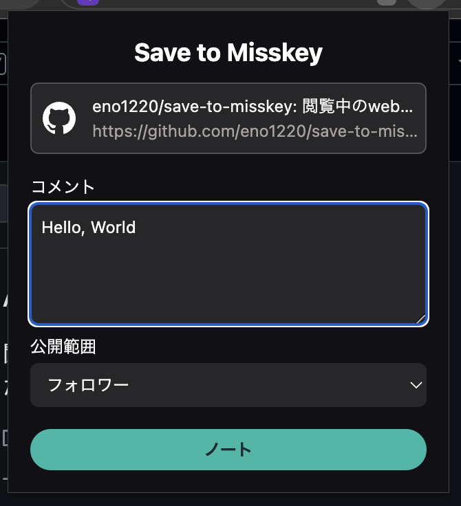
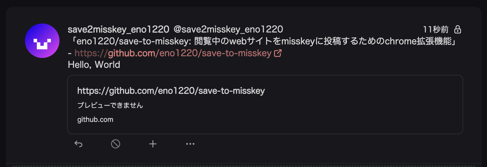

# Save to Misskey

## 概要

閲覧中のwebサイトをMisskeyに投稿するChrome拡張機能です。

利用するためにはMisskeyのアクセストークンが必要です。

[sasakulab/misskey-now](https://github.com/sasakulab/misskey-now)を参考に制作しました。

## インストール

1. コードをgit等を用いてダウンロードしたのちビルドするか、Releasesタブよりビルド済みのZipファイルをダウンロードし解凍する。
2. 拡張機能の管理ページ(chrome://extensions/)を開いて、「デベロッパーモード」を ON にする。
3. パッケージ化されていない拡張機能を読み込む」というボタンを押し、ビルドorダウンロードしたフォルダを選択する。

## 初期設定

### アクセストークンの発行

Misskeyで使用しているアカウントの「設定→API」から**アクセストークンの発行**を選択し、**ノートを作成・削除する**権限をもったトークンを発行してください

### アクセストークンの設定

拡張機能のアイコンを左クリックし、**拡張機能を管理**を選択→**拡張機能のオプション**から設定を行います。

- Misskeyのホスト: 利用しているMisskeyサーバのホスト名（misskey.example.com）を入力
- APIキー: 先ほど発行したアクセストークンを入力
- デフォルトの公開範囲: デフォルトでの公開範囲を設定（公開範囲は投稿する際、随時設定できます）

## 利用方法

Misskeyへ投稿したいページで拡張機能のアイコンをクリックし、「コメント」「公開範囲」を入力、選択した上で「ノート」をクリックするとMisskeyへ投稿できます。

todo: 拡張機能のインストール方法を掲載する
